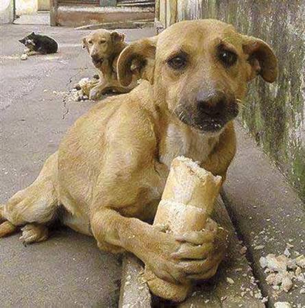
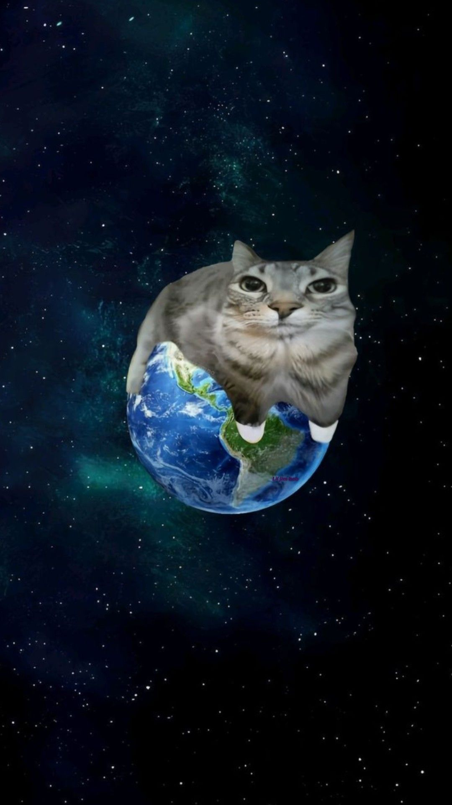

# Dibdən baxanda

> ### Əgər bu mesajı oxuyursansa, anonim şəkildə də olsa, bunu oxumağa nail olduğunu bildirsən, gözəl olar :)

Elə vaxtlar olub ki, xəyal qurmağı belə bacarmamışam. Səhər yuxudan durmaq istəməmişəm, gecə isə yatmaq. Günün başlaması da, bitməsi də mənə ağır gəlib.

Beynimdə iki səs var idi. Biri deyirdi: “Heç nə etmə, gücün yoxdur.” O biri isə boş keçirdiyim hər dəqiqəni üzümə vururdu. Nə dincələ bilirdim, nə də irəli gedə bilirdim. Bu çaxnaşmanın içində insan özündən də uzaq düşür. Bəzən fikirlərim elə kəskinləşirdi ki, özümlə baş-başa qalmaq istəmirdim. Sakitlik gələndə düşüncələrimin səsi daha da yüksəlirdi.

O vaxt mənə “Hər şey yaxşı olacaq” deyənlərə inanmaq çətin idi. Hansısa sözə, hansısa möcüzəyə tutunub səhər oyananda tamam başqa insan olacağımı gözləmək istəmirdim. Mən sadəcə yaşadığım bu ağırlığın bir gün indiki qədər ağır olmamasını istəyirdim.

Zaman haqqında çox şey deyirlər. Məncə, zaman təkbaşına heç nəyi həll etmir. Olanları silmir, cavabsız suallara cavab tapmır. Amma bəzən bir xatirənin ürəyimizdə tutduğu yeri yavaş-yavaş dəyişir. Bir gün gəlir, dünən səni boğan fikri xatırlayırsan və görürsən ki, artıq nəfəs ala bilirsən. Bəlkə də sağalmaq elə buradan başlayır: hər şeyi unutmaqdan yox, xatırlayanda da yaşamağa davam edə bilməkdən.

Əgər sən də indi o boşluğun içindəsənsə, özünü oradan dərhal çıxmağa məcbur etmə. Bu günü keçirmək üçün kiminsə əlindən tutmaq lazımdırsa, tut. Danışmaq lazımdırsa, danış. Kömək istəmək özünü aldatmaq deyil; ən çətin gündə belə özünə bir şans verməkdir.

Ümid edirəm, bir gün bu linkə yenidən girəndə həmin ağır günləri xatırlayacaqsan. Sonra ətrafına baxıb, bəlkə də çox sakit bir səslə deyəcəksən: “Yaxşı ki, o gün davam etmişəm.” :))

  <a href="https://izzooooooo.github.io/destek/"><strong>Hekayəni rahat oxumaq üçün səhifəni aç →</strong></a>

  
  &nbsp;&nbsp;
  

---

Əgər bu hisslər indi sənin təhlükəsizliyinə təsir edirsə, yaxın olduğun bir insana xəbər ver və yaşadığın yerdə təcili yardıma müraciət et. Tək qalmağın lazım deyil.
